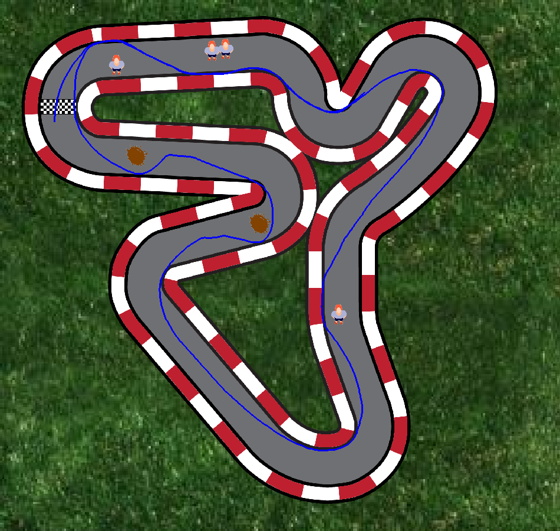

# Simon Bence Szakdolgozata | Szegedi Tudományegyetem Természettudományi és Informatikai Kar | Programtervező informatikus

Önvezető jármű vezérlésének megvalósítása virtuális kétdimenziós környezetben, mesterséges intelligencia alkalmazásával


A szakdolgozatom célja egy olyan szimulált mesterséges intelligencia (MI) modell által vezérelt
jármű kifejlesztése, amely képes irányítani azt egy virtuális környezetben. A modell a “sofőr”
szemszögéből szenzorok alapján kapott információkat használja fel, hogy meghatározza a
megfelelő irányítási parancsokat.

A dolgozathoz a Python programozási nyelvet fogom használni, ami nagyon fontos
szerepet játszik a mesterséges intelligencia fejlesztésben. Könnyen tanulható, hatékony,
magasszintű adatstruktúrát, objektum-orientáltságot, dinamikus típusosságot kínál a
fejlesztőknek, kutatóknak a természettudományok területén is. Nem beszélve a
megszámlálhatatlan modulról, ami a fejlesztők rendelkezésére áll.
A pálya megvalósításához a PyGame nevű Python modult fogom használni, amely
alkalmas egy kétdimenziós tér elkészítéséhez. A felülnézetes pálya útból, pálya szélből és
különböző akadályokból állhat, például sár és egyéb nehezítések. A felhasználó képes
befolyásolni az autó sebességét, kanyarodási képességét, valamint a gyorsulást és a fékezést.
Az önvezetés egy mesterséges neurális hálóval lesz megvalósítva. A mesterséges
neurális hálózat olyan számítógépes rendszereket takar, amely a biológiai idegrendszert
hivatottak utánozni. Az emberi agy neuronoknak nevezett idegsejtekből áll, a mesterséges
neurális hálók is hasonlóan működnek. Céljuk a gépi tanulás, ami a tanuló rendszerek gyakorlati
alkalmazása.

A mesterséges neurális hálózatok az emberi agy működését szimuláló számítási
modellek, amelyek a mesterséges intelligencia és gépi tanulás területén jelentős áttörést hoztak.
Strukturálisan rétegekből állnak, ahol minden rétegben több neurális egység található, amelyek
a biológiai neuronokhoz hasonlóan továbbítják az információt a következő rétegekbe.
A neurális hálózatok képesek összetett mintázatok és összefüggések felismerésére nagy
mennyiségű adatban, legyen az képfeldolgozás, beszédfelismerés vagy természetes
nyelvfeldolgozás. A hálózatok megtanulják ezeket a mintákat egy olyan folyamaton keresztül,
amelyet tanításnak nevezünk, és amely során egy hibafüggvény segítségével optimalizálják a
belső paramétereiket, az úgynevezett súlyokat. Ez a képességük teszi a mesterséges neurális
hálózatokat nélkülözhetetlenné olyan feladatoknál, amelyek az emberi intuíciót és megértést
igénylik.

A szakdolgozat bemutatja a modell architektúráját, a tanulási módszertant, az
alkalmazott technológiákat, valamint az eredményeket és az értékelést. További célja, hogy
bemutassa, hogy az MI modell hogyan képes adaptálni és javítani a vezetési teljesítményét
különböző körülmények között. 

## Futtatás

```bash
pip install -r requirements.txt
python DrivingGame/main.py model      # távolságmérő szenzoros neurális háló (alapértelmezett)
python DrivingGame/main.py expert     # távolságmérő szenzoros szabályalapú vezérlő (a háló tanára)
python DrivingGame/main.py model_v2   # az eredeti, színérzékelős neurális háló
python DrivingGame/main.py rule       # az eredeti szabályalapú vezérlő (automated_car.py)
python DrivingGame/main.py qlearning  # Q-tanulással betanított vezérlő
python DrivingGame/main.py manual     # kézi vezetés: W/A/S/D vagy nyilak
```

A jobb oldali panelen gyalogos és sár tehető a pályára (egérrel áthelyezhetők), a panel
számolja az elütött gyalogosokat. A sár lassítja az autót.

### Felépítés (`DrivingGame/`)

| Fájl | Tartalom |
|---|---|
| `main.py` | megjelenítés, vezérlőpanel |
| `simulation.py` | a szimuláció ablak nélkül: autó, akadályok, terep, ütközések |
| `car.py`, `sensors.py`, `assets.py` | autó, szenzorok (színérzékelő és távolságmérő), képek |
| `controllers.py` | vezérlési módok |
| `automated_car.py`, `model.py`, `model_control.py` | az eredeti szabályalapú vezérlő és színérzékelős háló |
| `expert.py`, `distance_model.py` | távolságmérő szenzoros vezérlő és az azt utánzó háló |
| `qlearning.py` | Q-tanulás |
| `evaluate.py` | vezérlők összehasonlítása rögzített és véletlen akadályos pályákon |

### Tanítás és kiértékelés (ablak nélkül)

```bash
cd DrivingGame
python distance_model.py   # adatgyűjtés a szakértővel + DAgger, -> distance_model.keras (~10 perc)
python qlearning.py 3000   # Q-tanulás 3000 epizódon, -> q_table_v2.npy (~10 perc)
python model.py            # az eredeti színérzékelős háló (CSV adatokból), -> automated_trained_model_v2.keras
python evaluate.py model expert qlearning model_v2 rule
```

### Eredmények (`evaluate.py`)

30 futás, mindegyikben 3 gyalogos és 2 sárfolt véletlen helyen, 1500 képkocka (kb. 25 mp):

| Vezérlő | Elütött gyalogos / futás | Futás elütés nélkül | Kör teljesítve | Kör üres pályán (képkocka) |
|---|---|---|---|---|
| `model` (távolságmérő háló) | 0,73 | 13/30 | 30/30 | 780 |
| `expert` (a háló tanára) | 0,67 | 14/30 | 25/30 | 780 |
| `qlearning` | 0,90 | 18/30 | 25/30 | 791 |
| `model_v2` (színérzékelős háló) | 4,27 | 0/30 | 30/30 | 694 |
| `rule` (eredeti szabályalapú) | 5,53 | 1/30 | 26/30 | 507 |

A távolságmérő szenzorok 160 px-ig látnak (a színérzékelők csak 40 px-ig), így az autó időben
lassít és kikerüli a gyalogost; cserébe óvatosabb, lassabb kört megy.


